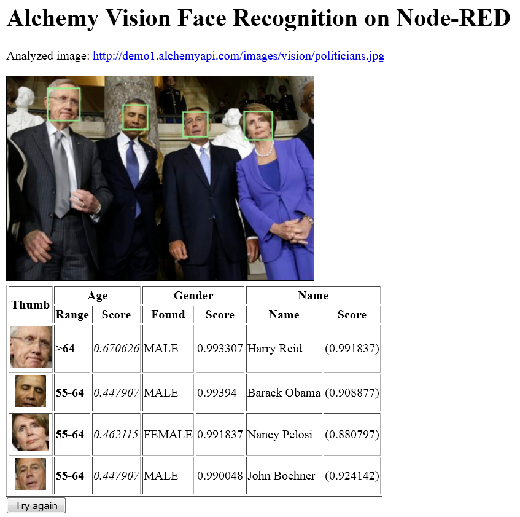

#  Node-RED Alchemy Vision (Image Analysis) Lab with thumbnails
## Overview
This lab will extend the capabilities of the [Alchemy Image Analysis Lab](../../watson_services_labs/alchemy_api_image_analysis/lab_alchemy_api_image_analysis.md), by leveraging more of the information returned by the Alchemy Vision API.

Among other information, the Alchemy Vision API provides the bounding rectangle for the detected faces.  
In this lab, we will use this information to enhance the output HTML page so that it highlights the recognized celebrities' faces and extracts their thumbnails.

## Alchemy Vision Face Identification Lab with thumbnails
We will use HTML5 Canvas with JavaScript code to implement bounding box and thumbnail rendering.

The HTML page code for the 'Report Faces' template will be updated with the following snippet:  
```HTML
<!DOCTYPE html>
<html>
<head>
    <title>Node-RED Alchemy Vision Face Recognition</title>
<script>
    // This function draws the main canvas
    function drawCanvas(img,ctx,cv_w,cv_h) {    
        // draw the image, resized to fit the canvas
        ctx.drawImage(img,0,0,cv_w,cv_h);
    }

    // This function draws a single thumbnail face on the mains
    // canvas context and then on the individual canvas
    function drawThumb(img,ctx,cv_w,cv_h,thumbX,thumbY,thumbW,thumbH,color,cvTh) {
        ctx.beginPath();
        // adjust thinkness of box depending on size vs canvas
        if(thumbW>=cv_w/12 || thumbH>=cv_w/12) {
            ctx.lineWidth="2";
        } else {
            ctx.lineWidth="1";
        }
        ctx.strokeStyle=color;
        ctx.rect(thumbX*cv_w/img.naturalWidth,
                 thumbY*cv_h/img.naturalHeight,
                 thumbW*cv_w/img.naturalWidth,
                 thumbH*cv_h/img.naturalHeight);
        ctx.stroke();
        
        // handle the thumb canvas
        var ctxTh = cvTh.getContext("2d");
        ctxTh.drawImage(img,thumbX,thumbY,thumbW,thumbH,
                        0,0,cvTh.width,cvTh.height);
    }

    function drawThumbs(img,ctx,cv_w,cv_h) {
        var cths=document.getElementsByClassName("cv_thumbs");
        var iTh=0;
        var color;
        {{#result}}
            color="lightgreen";
            {{^identity}}
            color="red";
            {{/identity}}
            drawThumb(img,ctx,cv_w,cv_h,{{positionX}},{{positionY}},{{width}},{{height}},color,cths[iTh++]);
        {{/result}}        
    }
    
    function drawAll() {
        // Find the image tag
        var img = document.getElementById("alchemy_image");
    
        // get canvas
        var c = document.getElementById("imageCanvas");
        var cv_w=c.width;
        var cv_h=c.height;

        // Adjust canvas size for correct aspect ratio
        if(img.naturalHeight>img.naturalWidth) {
            cv_w=cv_w*img.naturalWidth/img.naturalHeight;
            c.width=cv_w;
        } else {
            cv_h=cv_h*img.naturalHeight/img.naturalWidth;
            c.height=cv_h;
        }
        
        var ctx = c.getContext("2d");
        drawCanvas(img,ctx,cv_w,cv_h);
        drawThumbs(img,ctx,cv_w,cv_h);
    }
</script>
</head>
<body>
<h1>Alchemy Vision Face Recognition on Node-RED</h1>
<p>Analyzed image: <a href="{{payload}}" target='_blank'>{{payload}}</a><br/>
</p>
{{^result}}
<P>No Face detected</P>
{{/result}}
<canvas id="imageCanvas" width="400" height="400" style="border:1px solid #000000;">
    <p>Sorry, HTML5 Canvas not supported in your browser</p>
</canvas>
<table border='1'>
    <col align="center">
    <tr><th rowspan='2'>Thumb</th><th colspan='2'>Age</th><th colspan='2'>Gender</th><th colspan='2'>Name</th></tr>
    <tr><th>Range</th><th>Score</th><th>Found</th><th>Score</th><th>Name</th><th>Score</th></tr>
    {{#result}}
    <tr>
        <td style="text-align: center;"><canvas class="cv_thumbs" width='{{width}}' height='{{height}}'></canvas></td>
        <td><b>{{age.ageRange}}</b></td>
        <td><i>{{age.score}}</i></td>
        <td>{{gender.gender}}</td>
        <td>{{gender.score}}</td>
        {{#identity}}
        <td>{{identity.name}}</td><td>({{identity.score}})</td>
        {{/identity}}
    </tr>
    {{/result}}
</table>

<form  action="{{req._parsedUrl.pathname}}">
    <input type="submit" value="Try again"/>
</form>
</body>
</html>
```  
What this page does is to have an extra column appended up front, with a canvas where the rectangle of the face recognition will be drawn.  
In addition, the faces' bounding box rectangles will be drawn on the group photo, in red or green color depending on the face having been recognized or not.

## Testing the enhanced flow with thumbnails rendering:
This flow is deployed at the `/alchthumbs` URL, which will yield a page similar as this one:  


## Flow source code
The flow export is available at:  
[AlchVis-Lab-WebFacesThumbs](AlchVis_Lab_WebFacesThumbs.json).

## Suggested extensions
Based on this example, many extensions can be devised, such as handling mouse-over on the canvas to highlight the table row, or vice-versa.
