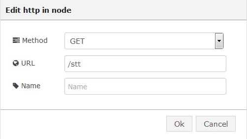

# Fetching word timestamps from the Speech to Text service

Document creation is in progress

## Overview
The speech to text services allows time alignment for each word in the transcript to be returned. Unfortunately the 
speech to text node only returns the default transcript. If you need alternative transcripts or time alignment then
you will need to call the service using a HTTP Response node. This exercise shows how to retrieve the time alignments for 
each word in the default transcript. You should be able to adapt this flow, and by modifying the paramaters into the 
service modify the response. eg. Fetch confidence levels for each word. 

## Initial Form
The flow begins by showing a form.


The entry point into the application is a HTTP Input configured to respond to a GET.



The switch node checks for a url.


The Template prompts the user to enter a url.

```
<h1>Speech to Text Demo on Node-RED</h1>
<h2>Enter a URL for the audio file</h2>
<form  action="{{req._parsedUrl.pathname}}">
    Url: <input type="text" name="url"/><br/>
    <input type="submit" value="recognize"/>
</form>
```

## Fetch the Audio
If a url has been provided, it should point to a wav 
file (eg. [Example Wav URL](http://www-mobile.ecs.soton.ac.uk/hth97r/links/Database/man1_wb.wav)
Use a function to setup a HTTP Request for the audio file


The contents of which is:

```
audiourl = encodeURI(msg.payload.url)
msg.url=audiourl;
return msg;
```

Use a HTTP Response node,


configured to return a binary buffer


## Invoke Speech to text
to be continued.

The completed flow is available at [Speech to Text Timestamps Flow](astt_speech_timestamps_flow.json)
