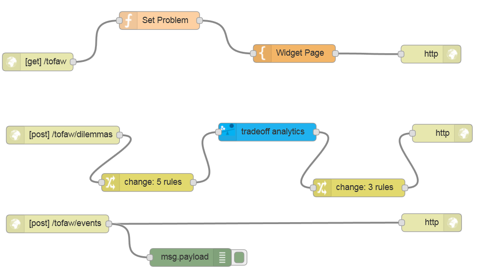
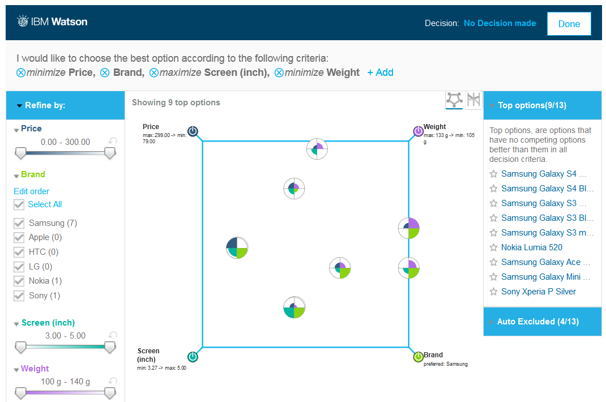

# Using the Trade-Off Analytics Widget with Node-RED
The Trade-Off Analytics service comes with a very versatile user interface widget which can be used to display the trade-off analytics results and let the user interact with them.

To use it, a web page will need to generated with some javascript code to create the widget and manage its initialization.
One point to keep in mind is that the widget operations, running within the client browser, are mostly asynchronous, so an event-driven chain of handlers should be used to properly initialize the widget.  
Once a problem will have been set client-side on the widget, it will call-back to the `./dilemmas` URL on the Node-RED flow, and optionally on the `./events` URL. The `./dilemmas` URL will call the Watson Tradeoff Analytics service and provide the answer to the widget which then display it and let the user interact with the results.

## Trade-Off Analytics Widget flow construction
The flow to achieve this has three streams:  


### User-interface serving stream
The stream connected on the `/tofaw` URL will serve a web page containing the TradeOff Analytics Widget HTML and JavaScript initialization code, and for the purpose of the exercise, a ready-made `problem` extracted from a problem object, as can be seen in the `Set Problem` function node. We create a JavaScript object with the 3 mandatory attributes, a `subject` string, a `columns` array describing the characteristics of the entities to consider, and a `options` array which represent the user's options (i.e. choices, as rows in the table) for the given problem:  
```javascript
// This is where we set the dimensions (columns) of the problem to analyze
// and the raw data (options)
var problem = {
  "subject": "phone",
  "columns": [{"key": "price", "type": "numeric", "goal": "min", "full_name": "Price", "is_objective": true,  "format": "####0.00" },
  ........
    "options": [{
      "key": " 1","name": "Samsung Galaxy S4 White",
      "values": {"weight": 130,"price": 239,"RAM": 2048,"battery": 2600,"camera": 13,"memory_size": 16,"screen_size": 5,"brand": "Samsung","rDate": "2013-04-29T00:00:00Z"},
      "description_html":
    .......
```

Then the Template node `Widget Page` is used to generate the HTML and JavaScript client-side code that will run in the browser and interact with the server:  
```HTML
<!DOCTYPE html>
<html>
<head>
    <meta name="viewport" content="width=device-width, initial-scale=1, maximum-scale=1, user-scalable=no">
    <title>Node-RED TradeOff Analytics Widget demo</title>
    <script type="text/javascript" src="http://ta-cdn.mybluemix.net/v1/TradeoffAnalytics.js"></script>
    <script>
    // get the problem object from Node-RED msg.problem
    // note the triple-curly braces syntax to avoid HTML escaping
    var problemObj={{{problem}}};
    
    // This variable will hold the TA client reference
    var taClient;
    
    // This creates the widget. We call asynchronously from the onload of the body
    function loadTradeoffAnalytics() {
		document.body.style.cursor="wait" ;
        taClient = new TradeoffAnalytics(
            {dilemmaServiceUrl: '{{{req._parsedUrl.pathname}}}/dilemmas',
             analyticsEventsUrl: '{{{req._parsedUrl.pathname}}}/events'
            }, 
            'tofaWidget');
        taClient.start(onTAReady);
    }

    // this is called-back when the widget is ready
    function onTAReady() {
        taClient.show(problemObj, onTAShown);
    }

    // this is called-back when the problem has shown in the widget
    function onTAShown() {
		document.body.style.cursor="default";
        taClient.resize();
    }
    
    // trigger the tofa widget setup when window has loaded
    window.onload=loadTradeoffAnalytics;
</script>
</head>
<body>
    <div id="tofaWidget" style="height:100vh"></div>
</body>
</html>
```  
What the \<script> section does is to:  
  - Include the widget's script located at "http://ta-cdn.mybluemix.net/v1/TradeoffAnalytics.js"
  - Start the widget initialization with the `loadTradeoffAnalytics()` call, triggered by `window.onload`.  
  - This invokes the constructor, with parameters to set the dilemmas and events callback URLs, and the id of the placeholder widget's \<div>.
  - The `start()` method is called, which will asynchronously build the widget and pull its dependencies.
  - On the TAReady event notification, we invoke `show(problem)`.  This will cause the widget to call-back on the server's `tofaw/dilemmas` URL with the problem for resolution.
  - Once the data has come back from the dilemmas server, the widget shows the problem and triggers onTAShown(), which is used to resize the widget to fit.

### Dilemmas serving stream
This flow on `tofaw/dilemmas` will make some parameters adjustments through a `change` node, setting `subject`, `columns` and `options` from the `payload`, storing the incoming `problem` for later use, and then calling the  through its Node-RED service node. On return, another `change` node will adjust the returned payload parameters's `problem`and `resolution` to fit the format expected by the widget and return it as a JSON object.

### Events serving stream
Notifications of events that happen on the widget will be received on that last stream at `/ tofaw/events`. Currently the flow does not do anything about the events, you can add a debug node to log the contents of the notifications.

## Testing the widget
Deploy the flow and point your browser at `http://xxx.mybluemix.net/tofaw`. Rendering of the widget should start and eventually yield a screen such as:  


## Trade-Off Analytics Widget flow file
The complete flow is in the file [Trade-Off Analytics Widget](TradeOffAnalyticsWidget.json)
