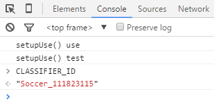

# Visual Recogition Training with your own images advanced Lab
## Overview
Version 2 of the Visual Recognition service allows you to build your own image classifications. There is, however, not
yet a node-RED node for this version of the Visual Recognition service. To allow you to use this training capability in
node-RED we have adapted the visual recognition sample application. We show you how to use the sample appplication to create
your own classifications, and our modified version provides an API that you can use to check an image against your visual 
classififier. 

## Training
In this section we show you how to create and train your own new visual recognition classifications. You can do this using 
our modified version of the visual recognition sample 
application [Visual Recognition sample application](https://visual-recognition-moscow.mybluemix.net/)

The sample application has an option that will allow you to create a custom classifier.  

Each classification needs a minimum of 50 positive and 50 negative images. So for example if you were creating 
classifications for sporting events, then for each event type you would provide 50 positive and 50 negative images. eg.
50 images showing Soccer, 50 images not showing soccer for the Soccer classification. Similary 50 positive and 50 negatives images 
for the Rugby classification. 

It may take a few minutes for your new classifier to be ready

Once it is ready you can begin to use your classification. You do, however, need the classifier id. You can get this when 
the test option is displayed

We will be modifying the application to display the classifier id, but for now you can determine the 
id using browser developer tools.

Switch to the console and type "CLASSIFIER_ID". The console will show you the ID for your Classifier.

Switch to the console.

... document creation still in progress.

The completed flow is available at [xyz.json](xyz.json)
