#Alchemy API Feature Extraction Introduction

AlchemyAPI uses natural language processing technology and machine learning algorithms to extract semantic meta-data from content, such as information on people, places, companies, topics, facts, relationships, authors, and languages, see -> [http://www.alchemyapi.com/api](http://www.alchemyapi.com/api)

## Get Alchemy API Key
Before starting this section you will need to obtain an Alchemy API key, follow the steps documented [here] (http://blog.alchemyapi.com/getting-started-with-alchemyapi-on-bluemix). 

## Lab Instructions
Open your NodeRed application ( created in previous labs ) and add the Alchemy API Service to it.  On your Node-RED application click on "Add a Service or API"

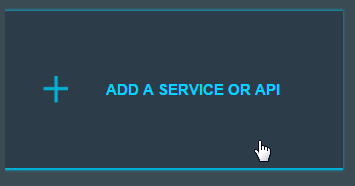

Pick the Alchemy API Service in the Watson section

Your application will be shown, click "Use" to bind the Alchemy API Service to your application

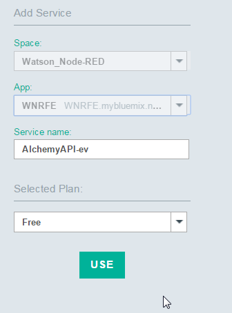

You will be prompted to Restage the application, click Restage.  Wait till the you see "Your app is running"

Click on your App link

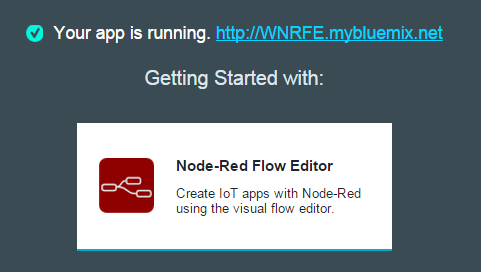

Click on the "go to your Node-RED flow editor" button

Drag an Inject node to the palette

Drag a Function node to the palette

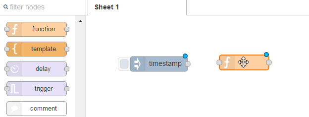

Drag a Alchemy API node to the palette

Finally drag a Debug node to the palette

Join the nodes as shown below

Double-click the Inject node and change the payload to Blank
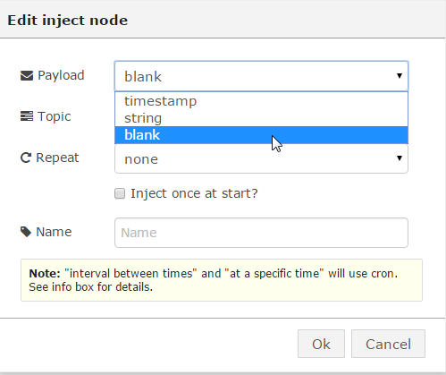

Copy the following text to your clipboard (highlight, ctrl-c)

**AlchemyAPI uses natural language processing, artificial intelligence, deep learning and massive-scale web crawling to power it's text analysis capabilities. Try entering your own text in this text box to see what knowledge AlchemyAPI can extract from your unstructured data.**

Double-click the Function node and type the text msg.payload=" (including the double quote) then paste (ctrl-v) the text

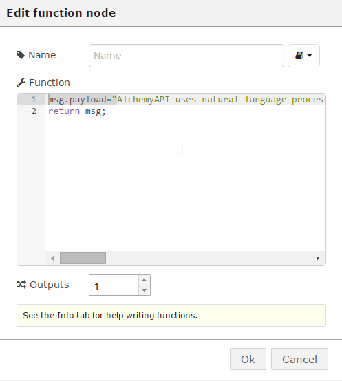

Now end the line with another double quote and semi-colon ;

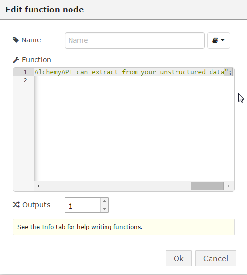

Double-click the Alchemy API Feature Extract node, when used for the first time it will ask for an API key, enter your key and also tick all the options

Finally double-click the Debug node and change "payload" to "features"

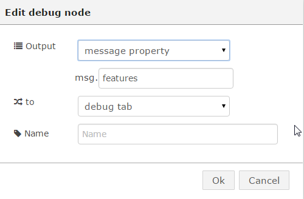

Click the Deploy button

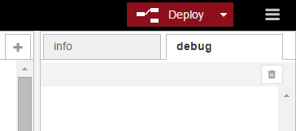
 
Click on the Debug Tab below the Deploy button to show the debug window.

Go back to the palette and click the Inject node "inject" button 

Look in the Debug tab and you will see a JSON object of the analysis of the text sent to the AlchemyAPI node

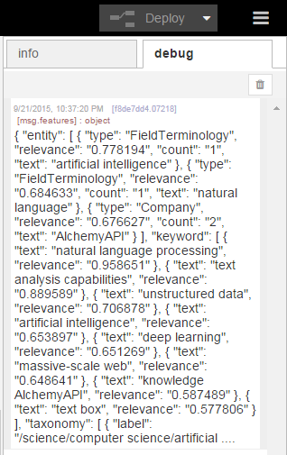

If you need to send custom parameters along with each feature, set those parameters as children of the msg.alchemy_options object - this is not going to be covered in this lab

NOTE : a URL can be specified instead of a text input 

Drag a HTTP request node to the palette

Connect an Inject node to the HTTP request node, set the Inject node to Blank and join it the the HTTP request node.  Join the HTTP request node to the AlchemyAPI Feature Extract node

Double-click the HTTP request node and enter ibm.com to the URL field

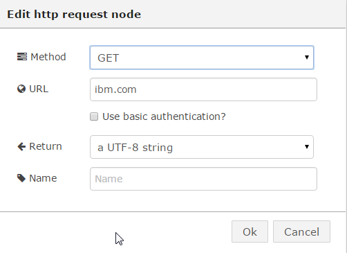

Click the Deploy button and then the Inject button connected to the HTTP request node.  You should see an output in the Debug Tab

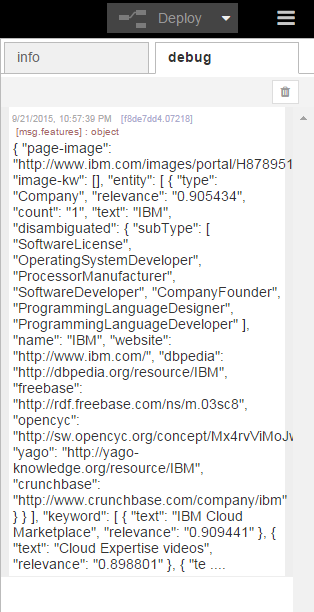

Go to [http://www.alchemyapi.com/products/demo/alchemylanguage](http://www.alchemyapi.com/products/demo/alchemylanguage) and pick the Enter your new URL option and enter ibm.com and click "Try it!"   Scroll down to see a Visual representation of the results

Click the JSON button and you will see the same text as was shown in the Debug Tab of Node-RED

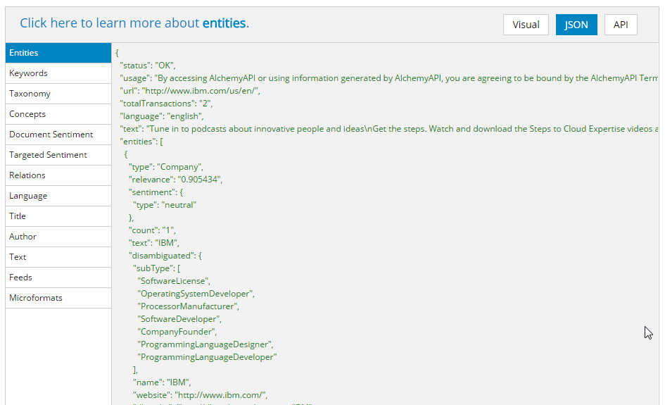

The flows for this lab are here -> [flows](lab_alchemy_api_feature_extraction_flows.json)
