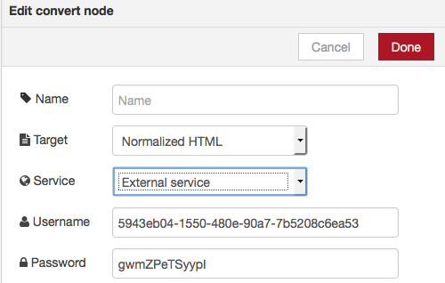
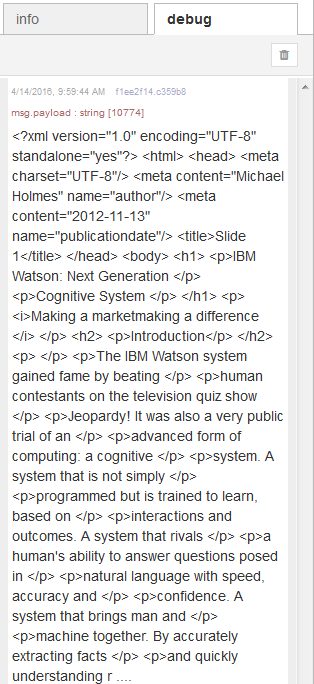
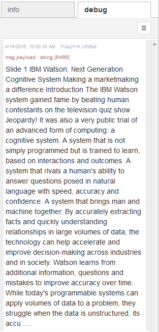

#Document Conversion node for Node-RED
## Overview

The Document Conversion Service converts a single HTML, PDF, or Word document. The input document is transformed into normalized HTML, plain text, or a set of JSON-formatted Answer units that can be used with other Watson services, like the Watson Retrieve and Rank Service.

The input message to the Document Conversion node must provide the file to be converted either as a binary stream or the URL to file contents. it is, also, possible to specify information on the formats in the document. For more information on the different options please see the [Document Conversion documentation] (https://www.ibm.com/smarterplanet/us/en/ibmwatson/developercloud/doc/document-conversion/customizing.shtml).

In this example the Document Conversion node will take a PDF document and convert it to HTML, therefore we will provide a PDF input configuration definition with the URL for the file in the function. The URL for this file is https://www.ibm.com/developerworks/community/blogs/efc1d8f5-72e5-4c4f-99df-e74fccea10ca/resource/White%20Papers/IBMWatsonNextGenerationofCognitiveSystemswhitepaper.pdf.

In the configuration dialog for the node you need to provide the output format and the credentials. In this example, the credentials (userid and password) can be specified either by selecting an existing service that has been added to your Node-RED application or providing them manually and the output format, Normalized HTML, can be selected from the drop-down list. **Do not use the credentials in the diagram they will not work)**

Once the document has been converted, the output will be placed on the msg.payload and displayed in the debug area. The contents will depend on the type of conversion: text, JSON or HTML.

* Normalized HTML option

* Answer unit option (Change the Target in the node to Answer Units, deploy the flow and rerun).

* Normalized text option (Change the Target in the node to Normalized Text, deploy the flow and rerun).

