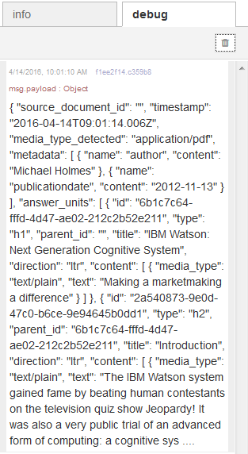

#Document Conversion node for Node-RED
## Overview

The Document Conversion service provides an API that enables developers to transform a document into a new format. 
The input is a single PDF, Word, or HTML document and the output is an HTML document, a Text document, or Answer units 
that can be used with other Watson services: prepare documents for use with the Watson Retrieve and Rank Service.

In this example the Document Conversion node will take one document and convert it to plain HTML. 

The input message to the Document Coversion node must provide the file to be converted in the payload either as a binary stream or the URL to file contents. Additionally it is possible to specify information on the formats in the document. More information on the different options [Document Conversion documentation](https://www.ibm.com/smarterplanet/us/en/ibmwatson/developercloud/doc/document-conversion/customizing.shtml). In this example a PDF file will be converted and so a pdf field has been included with the format details. The URL for this file is https://www.ibm.com/developerworks/community/blogs/efc1d8f5-72e5-4c4f-99df-e74fccea10ca/resource/White%20Papers/IBMWatsonNextGenerationofCognitiveSystemswhitepaper.pdf.

In the configuration dialog for the node only the output format and the credentials have to be provided. Credentials can be specified either selecting an existing Alchemy service binded to the Node-RED application or providing them manually.
The output format can be selected from three different options: a Answer unit JSON, a plain text or a HTML document.

Once the document has been converted, the output will be placed on the msg.payload. The contents will depend on the type of conversion: text, JSON or HTML (in a XML).

* Normalized HTML option

* Answer unit option

!

* Plain text option

[Conversion output TEXT](images/dc_output_txt2.png)
