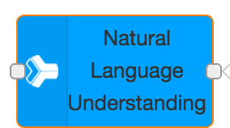
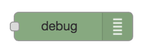
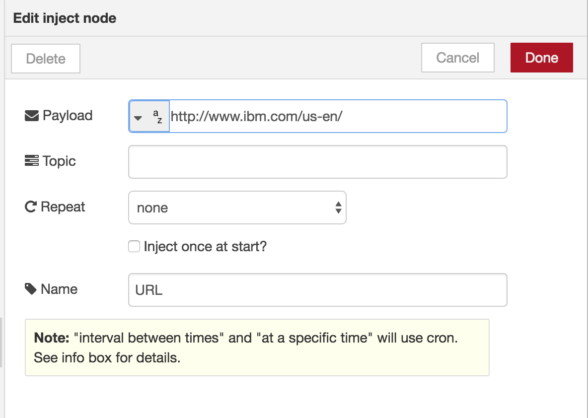
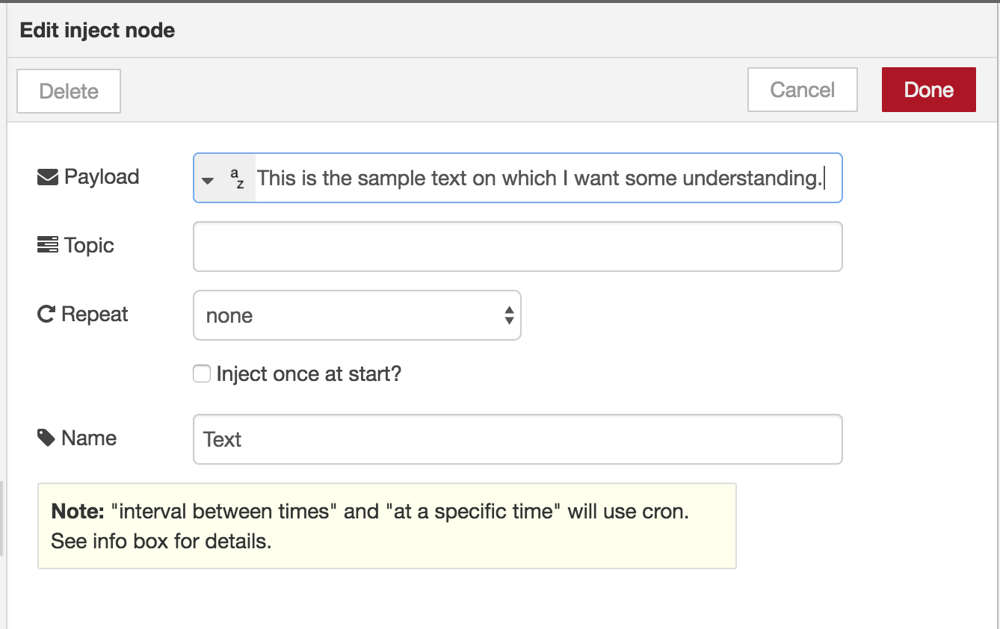
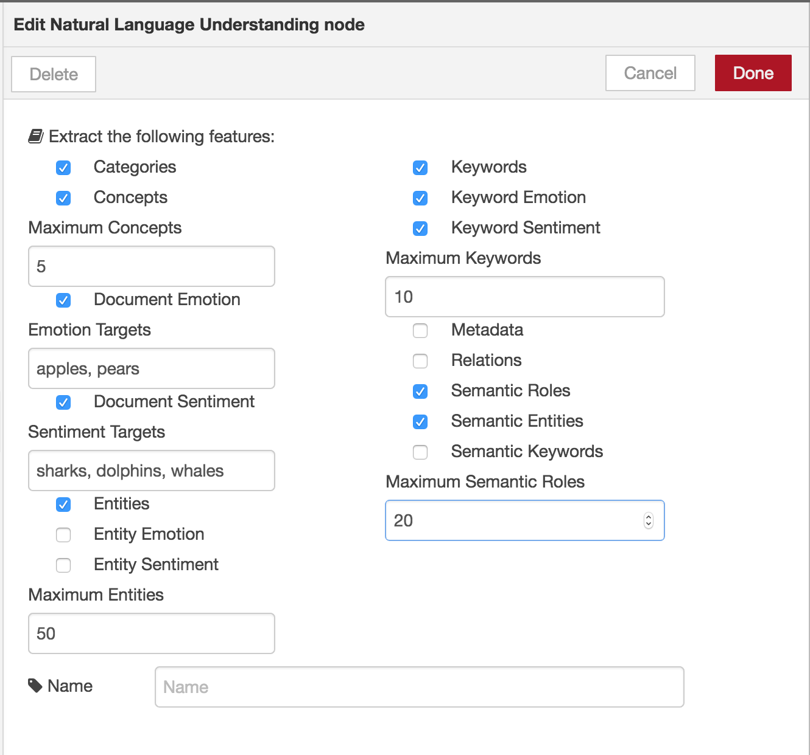
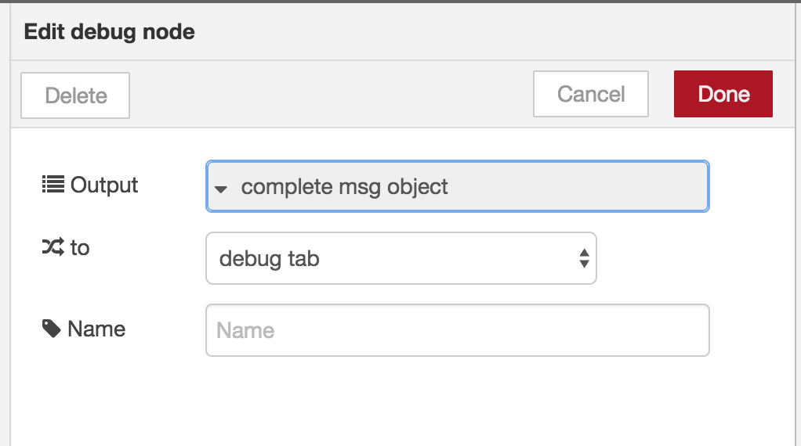

# Natural Language Understanding

## Overview
The Natural Language Classifier is a service that can analyze semantic features of text input, including - categories, concepts, emotion, entities, keywords, metadata, relations, semantic roles, and sentiment.

- [Overview](https://www.ibm.com/watson/developercloud/doc/natural-language-understanding/) of the Natural Language Understanding service.
- [Demo](https://natural-language-understanding-demo.mybluemix.net/) of the service.
- [API reference](https://www.ibm.com/watson/developercloud/natural-language-understanding/api/), which includes helpful information about curl and the SDKs.

## Getting Started
Before you can use the service through the node on node-RED you will need to create an instance of the service in Bluemix.

To bind the new service to your instance of Node-RED select the connections tab for your new service

 

and create the connection to your Node-RED instance.

## Building the Flow

### Required Nodes
Add the following nodes from the palette to your flow canvas

Two Inject nodes.

A Natural Language Understanding node.

A Debug node.

### Flow Wiring
Wire the nodes together.

### Node configuration
The first inject node will be used to inject a url into the flow.

The second inject node will be used to inject text into the flow.

Configure the Natural Language Understanding node for the service
features that you want to detect.

Configure the debug node to show the complete msg object.

### Completed Configuration
You flow should look like

## Trying your flow
The Natural L

## Completed Flows
The complete flow is available at [flows](nlu_flow.json) 
