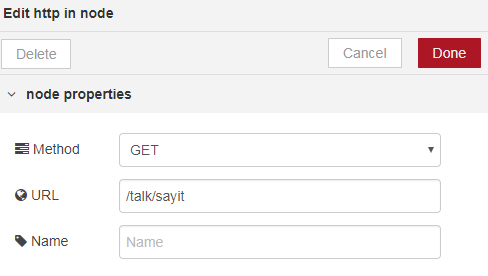
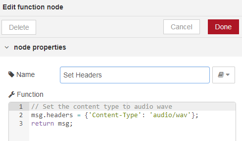
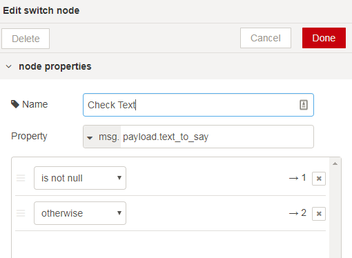
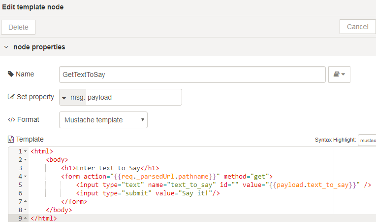
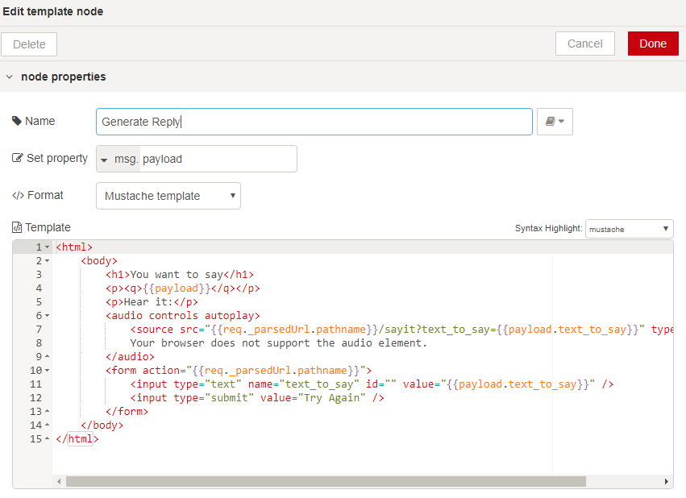

# Lab: Text to Speech with Node-RED
## Overview
The Watson Text-To-Speech (TTS) service produces an audio file from literal text. The spoken text can be emitted with a choice of voices and languages.

## Node-RED Watson Text to Speech node
The  Node-RED node provides a very easy wrapper node that takes a text string as input and produces a binary buffer holding the spoken text audio stream in `.wav` format.

The selection of language and voice are made through the node's properties editor. Supported languages are found [here.](https://console.bluemix.net/docs/services/text-to-speech/http.html#languageVoices)

### Prerequisites and setup
To get the Text to Speech service credentials on IBM Cloud automatically filled-in by Node-RED, you should connect the Text to Speech service to the Node-RED application in IBM Cloud.


Please refer to the [Node-RED setup lab](/introduction_to_node_red/README.md) for instructions.

## Watson Text to Speech Flow
This lab is in three sections. Section one is the main section.

- In section one, you will produce a `.wav` file from input text through a simple web page generated using a Node-RED flow.
- In section two, you will add parameter checking to the flow you create in section one.
- In section three, you will build a flow that presents a dialog to the user with a prompt to enter the text to say. It returns a HTML page with a tag which plays the audio.

## Section One
The first section will take text input from a web invocation and return the spoken text `.wav` file:

In Node-RED, create a new flow by clicking the '+' on the top right corner. Call it `TTS Web`

Add a HTTP Input node to collect the incoming speech request. Set the `URL` property of this node to `/talk/sayit` This URL will be exposed on http://xxxx.mybluemix.net/talk/sayit



When invoked with query parameters such as `?text_to_say=Hello`, they will be added as properties on the `msg.payload` object.

Add a change node to extract the query parameter `msg.payload.text_to_say` and set it as the `msg.payload`.


You need to do this because the Text to Speech node uses the text in the `msg.payload` as input.

Next add a Text to Speech node. This node will generate the binary `wav` stream content to the `msg.speech` property. The properties of the Text to Speech node will let you select the Language and Voice to use.


Add another change node to extract the `msg.speech` and place it in `msg.payload`.


The next step is to set the `HTTP response headers` by setting the `msg.headers` to the literal string value `[{ 'Content-Type':'audio/wav'}]`. This is required in order to properly set the HTTP headers so that the response can be identified as audio in .wav format by the receiving browser. Add a function node with the following code:  
```javascript
msg.headers={ 'Content-Type': 'audio/wav'};
return msg;
```
  

Finally, add a HTTP Response node. This node will simply return what's in the payload to the HTTP response.

Join all the nodes together. The completed flow should look like:


_Now try the flow:_

* Open a new tab or window in your browser, and direct it to `http://xxxx.mybluemix.net/talk/sayit?text_to_say=Hello`
* This should prompt you to save a file.
Depending on how your browser is configured, it may save it automatically or prompt for a name and location. In any case, store or rename it with the `.wav` extension on your local file system.
* Then locate that file from windows explorer and open it with Windows Media Player.


### Flow Source
The complete flow is available [here](tts_lab_basic.json).

## Section Two enhancements: Input Parameter Checking
The flow in Section One has a flaw, which is that the flow will fail when the `text_to_say` query parameter is not set.

To overcome this, add a `function` node between the `HTTP In` and `Text to Payload` nodes.


This node will check if `msg.payload.text_to_say` is true, otherwise divert it to a `template` node that display an an error message on the webpage.

Configure the function node with the following code and set the number of outputs to 2.

```JAVASCRIPT
if (msg.payload.text_to_say) {
    return [msg, null];
}
return [null, msg];
```


Connect the first output from the function node to the `Text to Payload` node, and the second output to a new `template` node and link this to the `HTML Response` node.

Add the following code to the template node:
```html
<h1>Missing text_to_say query param!</h1>
```


The template node simply outputs a HTML message in a <h1> header.

The completed flow should look like:


_Now try the flow:_

* Open a new tab or window in your browser, and direct it to `http://xxxx.mybluemix.net/talk/sayit?text_to_say=`
* You should see the HTML webpage which says `Missing text_to_say query param!`

### Flow Source
The complete flow is available [here](tts_lab_with_param_check.json).

## Section Three enhancements: Text to Speech Interactive Web UI
As an extension, you can build a flow that will present a dialog to the user with a prompt to enter the text to say, and return a HTML page with an <audio> tag which will play the generated audio.

For this, the basic flow which converts a text into speech audio wav file can be leveraged and complemented with a HTTP web interaction. This is depicted in the flow as below:


To achieve this, add a new `HTTP input` node, listening on the `/talk` URL.

Add a `switch` node to check for the msg.payload.text_to_say property. When there is no text to convert to speech, you want it to output a prompt to ask the user for text. If there is text, you want it to generate a reply. To achieve this, set the first rule to `is not null`. This will generate the reply. Add a second rule and set it to `otherwise`, which will prompt the user for text.  



Add 2 template nodes and link them to the two outputs from the switch node. Name the first one `Generate Reply` and the second `GetTextToSay`.

For the `GetTextToSay` template node,  paste in the following code:

```HTML
<html>
    <body>
        <h1>Enter text to Say</h1>
        <form action="{{req._parsedUrl.pathname}}" method="get">
            <input type="text" name="text_to_say" id="" value="{{payload.text_to_say}}" />
            <input type="submit" value="Say it!"/>
        </form>
    </body>
</html>
```


When the text_to_say query parameter is set, a HTML page is generated with a <audio> tag. The tag refers to the `/talk/sayit` URL which gets the audio `wav` file.

In the `Generate Reply` template node, paste in the following code. This converts the text into speech.
```HTML
<html>
<body>
    <h1>You want to say</h1>
    <p><q>{{payload}}</q></p>
    <p>Hear it:</p>
    <audio controls autoplay>
        <source src="{{req._parsedUrl.pathname}}/sayit?text_to_say={{payload.text_to_say}}" type="audio/wav">
        Your browser does not support the audio element.
    </audio>
    <form action="{{req._parsedUrl.pathname}}">
        <input type="text" name="text_to_say" id="" value="{{payload.text_to_say}}" />
        <input type="submit" value="Try Again" />
    </form>
</body>
</html>
```


Finally add a HTTP Response node and link the two template nodes to it.


_Now try the flow:_

* Open a new tab or window in your browser, and direct it to `http://xxxx.mybluemix.net/talk`
* Enter some text and hear the response

The complete flow is available at [TTS-Lab-WebPage](tts_lab_webpage.json).

## Text to Speech Documentation
To find more information on the Watson Text to Speech underlying service, visit these webpages :
- [TTS Documentation](https://console.bluemix.net/docs/services/text-to-speech/index.html#about)
- [TTS API Documentation](https://www.ibm.com/watson/developercloud/text-to-speech/api/v1/)
