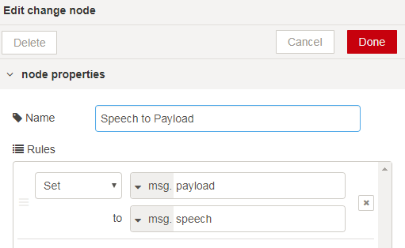
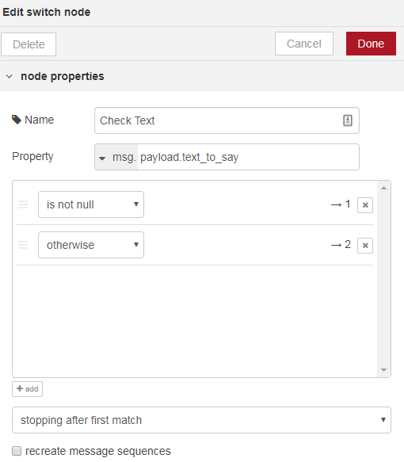
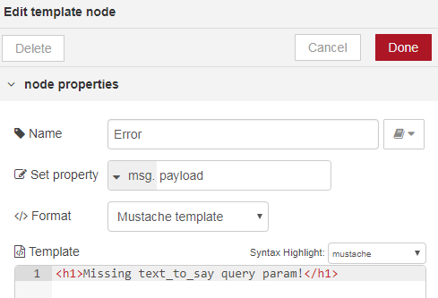
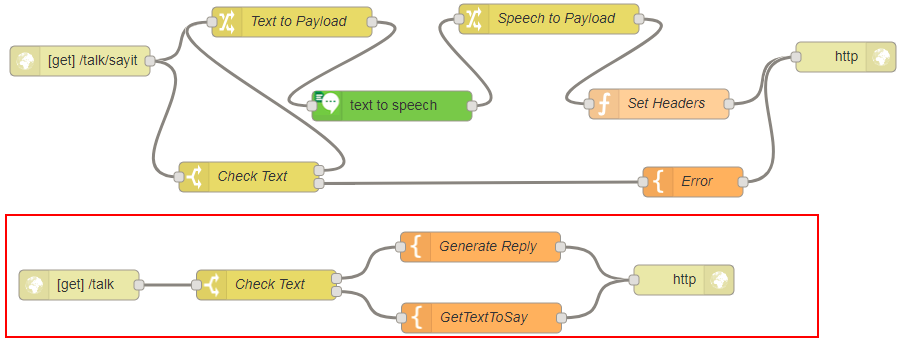

# Watson Text to Speech with Node-RED Lab
### Overview
The Watson text-To-Speech (TTS) service produces an audio file from literal text.
The spoken text can be emitted with a choice of voices and languages.

### Node-RED Watson TTS node
The Node-RED node provides a very easy wrapper node that takes a text string as input and produces a binary buffer holding the spoken text audio stream in `.wav` format.
The selection of language and voice are made through  the node's properties editor.

### Basic TTS Flow
In this first exercise, we will show how to simply produce a `.wav` file from input text through a simple web page generated using a Node-RED flow.

The first part of the flow will take text input from a web invocation and return the spoken text `.wav` file:

1. Open the Node-RED Flow Editor and create a new flow by clicking the '+' on the top right corner. Let's call it `TTS Web` 
2. Add an  node to collect the incoming speech request. Set the `URL` property of this node to `/tts/sayit` This URL will be exposed below our BlueMix main URL.

When invoked with query parameters such as `?text_to_say=Hello`, they will be added as properties on the `msg.payload` object. 
3. Add a  node to 
extract the query parameter `msg.payload.text_to_say` and set it as the `msg.payload`.


We do this because the TTS node uses the text in the `msg.payload` as input.
4. Now add a  node. This node will generate the binary `wav` stream content to the `msg.speech` property.


5. The properties of the TTS node will let you select the Language and Voice to use.

6. Add another  node to extract the `msg.speech` and place it in `msg.payload`. 


7. We will set the `HTTP response headers` by setting the `msg.headers` to the literal string 
value `[{ 'Content-Type': 'audio/wav'}]`. This is required in order to let browsers know that this 
is an audio file and not HTML. Add a  node 
with the following code:  
```javascript
msg.headers={ 'Content-Type': 'audio/wav'};
return msg;
```
  
This is required in order to properly set the HTTP headers so that the response can be identified as audio in Wave format by the receiving browser.
8. Finally, add a   node. This 
node will simply return what's in the payload to the HTTP response.
The completed flow should look like:


The flow code for this is in [TTS-Lab-Basic](tts_lab_basic.json).

_Now try the flow:_

* Open a new tab or window in your browser, and direct it to `/http://xxxx.mybluemix.net/tts/sayit?text_to_say=Hello`
* This should prompt you to save a file.
Depending on how your browser is configured, it may save it automatically or prompt for a name and location. In any case, store or rename it with the `.wav` extension on your local file system. 
* Then locate that file from windows explorer and open it with Windows Media Player.

### TTS Flow - enhancements: Input Parameter Checking
This flow has a caveat, which is that the flow will fail when the `text_to_say` query parameter is not set.

So, we will introduce a `switch` node between the `[get]` and `change` nodes. This node will check if `msg.payload.text_to_say` is set, and otherwise divert to a `template` node that will simply set the payload to a error text.

You'll notice that adding the second `otherwise` rule has created a second output handle for the `switch` node, we'll connect this to a `template` node and then to the `HTML Response` node.

The template node simply outputs a HTML message in a h1 header.
Flow for this can be found in [TTS-Lab-Basic](tts_lab_with_param_check.json)
The final flow will look like:


#### TTS Interactive Web UI
As an extension, we can build a flow that will present a dialog to the user with a prompt to enter the text to say, and return a HTML page with an <audio> tag which will play the generated audio.

For this, the basic flow which converts a text into speech audio wav file can be leveraged, and complemented with a HTTP web interaction. This is depicted in the flow as below::
>

We added a new `HTTP input` node, listening on the `/talk` URL, and modified the text-to-wav HTTP URL to `/talk/sayit` so that it doesn't conflict with the previous Lab. The `choice` node checks for the text_to_say query parameter, and when not present outputs a simple web page using the `GetTextToSay` template:
```HTML
    <h1>Enter text to Say</h1>
       <form action="{{req._parsedUrl.pathname}}" method="get">
          <input type="text" name="text_to_say" id="" value="{{payload.text_to_say}}" />
          <input type="submit" value="Say it!"/>
       </form>
```


When a text_to_say query parameter is set, we generate an HTML page with a \<audio> tag that refers to the `/talk/sayit` URL to get the audio `wav` file:
```HTML
    <h1>You want to say</h1>
    <p><q>{{payload}}</q></p>
    <p>Hear it:</p>
    <audio controls autoplay>
      <source src="{{req._parsedUrl.pathname}}/sayit?text_to_say={{payload.text_to_say}}" type="audio/wav">
        Your browser does not support the audio element.
    </audio>
    <form action="{{req._parsedUrl.pathname}}">
        <input type="text" name="text_to_say" id="" value="{{payload.text_to_say}}" />
        <input type="submit" value="Try Again" />
    </form>
```


The complete flow is available at [TTS-Lab-WebPage](tts_lab_webpage.json).

To run it, point your browser to  `/http://xxxx.mybluemix.net/tts/talk` and enter some text.
