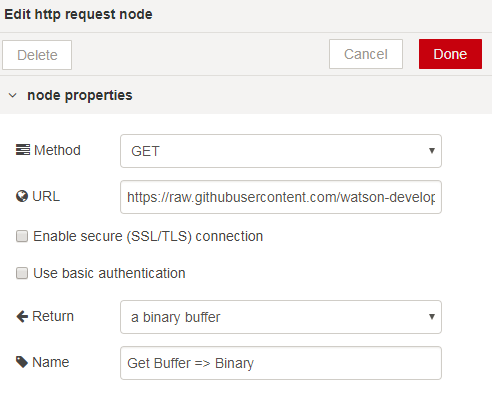
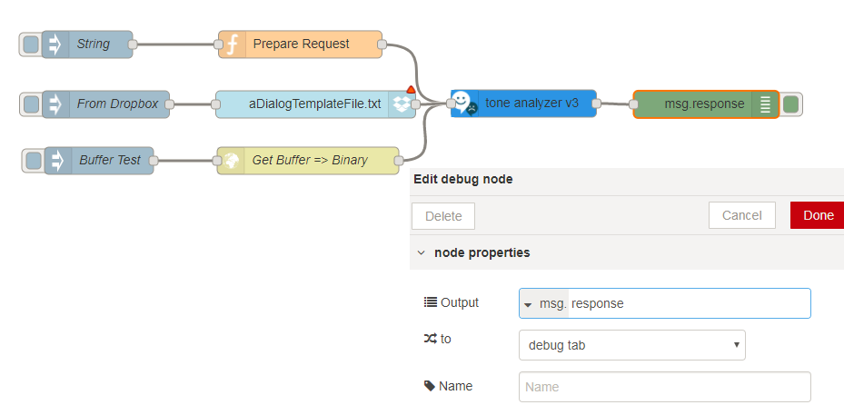
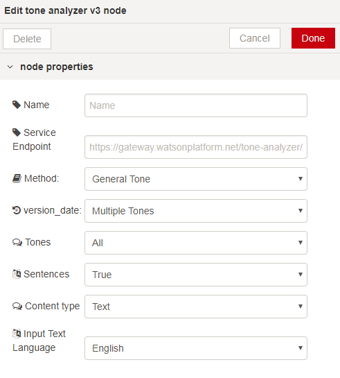

# Tone Analyser service

## Overview

The IBM Watson™ Tone Analyzer Service uses linguistic analysis to detect three types of tones from written text: emotions, social tendencies, and writing style. Emotions identified include things like anger, fear, joy, sadness, and disgust. Identified social tendencies include things from the Big Five personality traits used by some psychologists. These include openness, conscientiousness, extraversion, agreeableness, and emotional range. Identified writing styles include confident, analytical, and tentative.

Input email and other written media into the Tone Analyzer service, and use the results to determine if your writing comes across with the emotional impact, social tone, and writing style that you want your intended audience to see. 

## On Bluemix

If you are using Node-RED on Bluemix, go to your Node-RED app and click 'add a service or API' This will open a new window where you can select the Watson Tone Analyser service. Then you click on 'Create' a screen will show which asks for a restage, click on 'Restage' and wait a minute. When the application is started click on the Url to go to your Node-RED application.

## How to use the Tone Analyser node ?

Copy an inject node :

You must provide in Input of the Tone Analyser (msg.payload) either :

- a string
- a Node.js Buffer

The provided Flows file (see below) proposes you amongst 3 differents way to connect the Input of the Tone Analyser node:

- Function node : you directly specify the string in the msg.payload
- Drobox node : you use a Dropbox account that hold the text file you want to be processed
- Buffer : you can provide any text source in binary format, but it should be a Node.js Buffer. (ex : the HTTP REQUEST node using the binary mode)

## Connect a Function node as input

> Not in scope ## Connect a Dropbox node as input

>

> To configure a Dropbox node please follow the [Dropbox nodes setup](https://github.com/watson-developer-cloud/node-red-labs/tree/master/utilities/dropbox_setup) procedure.

## Connect a (Node.js) Buffer as input

You can take a HTTP REQUEST node and configure it such :
- mode : GET
- URL : specify a valid URL where the text file is accessible
- Return : select Binary

Drag and drop a Tone Analyser node from the nodes palette, and wire it with your input node.

Add a Debug Node, and configure it to msg.response to see only the results data from the Tone Analyser node.

Now configure your Tone Analyser node by selecting in the dropdown list 
- the Tones (All / Emotion / Social / Writing): by default All. 
- the Sentences Flag (True / False) : by default the value is True

Availables options for Tones

Availables options for Sentences

## Available Flows :
- [Tone Analyser Flow](flow.json) : illustrates all kind of inputs availables for the Tone Analyser node.

## Tone Analyser Documentation

To have more information on the Watson Tone Analyser underlying service, you can check these two reference :
- [Tone Analyser Documentation](http://www.ibm.com/smarterplanet/us/en/ibmwatson/developercloud/doc/tone-analyzer/)
- [Tone Ananalyser API Documentation](http://www.ibm.com/smarterplanet/us/en/ibmwatson/developercloud/tone-analyzer/api/v3/)

<n>Notice</b> : as this flow suggest it, you can also use Dropbox  : How to setup your Node-RED with [Dropbox nodes](https://github.com/watson-developer-cloud/node-red-labs/tree/master/utilities/dropbox_setup)

