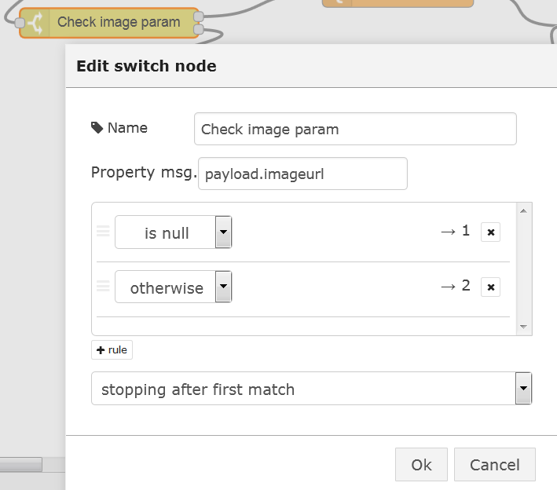
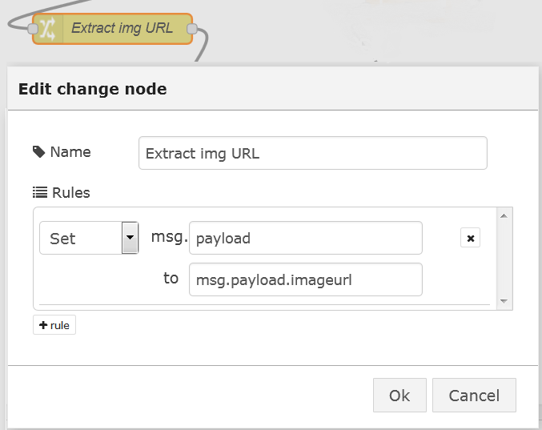
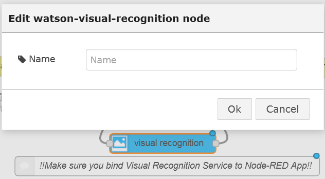
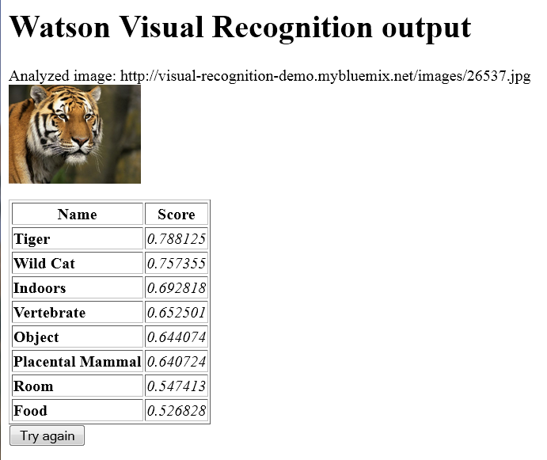

#  Lab: Watson Visual Recognition with Node-RED
## Overview
The Watson  Visual Recognition service allows to analyse the contents of an image and produce a series of text classifiers with a confidence index.

## Node-RED Watson Visual Recognition node
The Node-RED  node provides a very easy wrapper node that takes an image URL or binary stream as input, and produces a set of image labels as output.

## Watson Visual Recognition Flow construction
In this exercise, we will show how to simply generate the labels from an image URL.

### Prerequisites and setup
To get the service credentials automatically filled-in by Node-RED from the BlueMix credentials, the Visual Recognition Service should be bound to the Node-RED application in BlueMix.


Please refer to the [Node-RED setup lab](../../node-RED_labs/lab_node-RED.md) for instructions.

### Building the flow
The flow will present a simple Web page with a text field where to input the image's URL, then submit it to Watson Visual Recognition, and output the labels that have been found on the reply Web page.

The nodes required to build this flow are:

 - A  node, configured with a `/reco` URL
 - A  node which will test for the presence of the `imageurl` query parameter:
   
 - A first  node, configured to output an HTML input field and suggest a few selected images taken from the main Watson Visual Recognition demo web page:
```HTML
    <h1>Welcome to the Watson Visual Recognition Demo on Node-RED</h1>
    <h2>Select an image URL</h2>
    <form  action="{{req._parsedUrl.pathname}}">
        
        
        
        
        <br/>Copy above image location URL or enter any image URL:<br/>
        <input type="text" name="imageurl"/>
        <input type="submit" value="Analyze"/>
    </form>
```

 
- A  node (named `Extract img URL` here) to extract the `imageurl` query parameter from the web request and assign it to the payload to be provided as input to the Visual Recognition node:


 - The  node. Make sure that the credentials are setup from bluemix, i.e. that the service is bound to the application. This can be verified by checking that the properties for the Visual Recognition node are clear:
 

 - And a final   node linked to the  output node. The template will format the output returned from the Visual Recognition node into an HTML table for easier reading:
```HTML
    <h1>Node-RED Watson Visual Recognition output</h1>
    <p>Analyzed image: {{payload}}<br/></p>
    <table border='1'>
        <thead><tr><th>Name</th><th>Score</th></tr></thead>
        {{#labels}}
          <tr><td><b>{{label_name}}</b></td><td><i>{{label_score}}</i></td></tr>
        {{/labels}}
    </table>
    <form  action="{{req._parsedUrl.pathname}}">
        <input type="submit" value="Try again"/>
    </form>
```
  
Note that the HTML snippet above has been simplified and stripped out of non-essential HTML tags, the completed flow solution has a complete HTML page.

### Testing the flow
To run the web page, point your browser to  `/http://xxxx.mybluemix.net/reco` and enter the URL of some  image.
The URL of the pre-selected images can be copied to clipboard and pasted into the text field.

The Watson Visual Recognition API will return an array with the recognized features, which will be formatted in a HTML table by the template:


### Flow source
The complete flow is available at [Reco-Lab-WebPage](Reco-Lab-WebPage.json).
