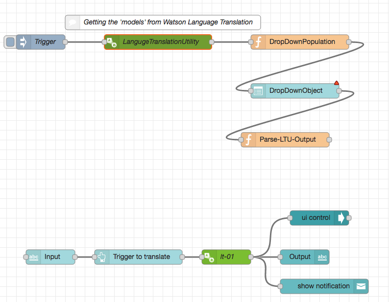
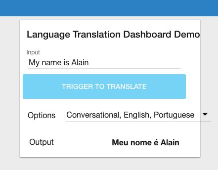

# Dashboard Translation

To be posted!

## Overview

Uses the 'Language Translation Util', 'Language Translation', 'Dashboard DropDown', 'Dashboard Text Input' and 'Dashboard Text Output' nodes to create a user friendly interface for the language translation.

The UI allows a user to enter a text and chose the translation options and obtain the translated text.

Node-RED will:
* Let you input some text
* Offer to chose translation modes
* Send back and display the translated text based upon the chosen options

## Application flow

- Application Flow:

[dashboard-translation-node.json](./dashboard-translation-node.json)

[dashboard-translation.png](./dashboard-translation.png)

- Application Output:

[dashboard-translation-utility-sample.png](./dashboard-translation-utility-sample.png)

## Flow description

1. The 'inject' flow is triggered with a timestamp input injection at the beginning.

2. The 'language translation-util' (language translation utility) fetches the language translation mode, and exposes the following objects as global variables;
  - msg.model_id (eg: en-fr-conversational),
  - msg.domain (eg: conversational),
  - msg.source (eg: english),
  - msg.target (eg: french),

3. A 'function' flow sends the msg.payload to the dashboard dropdown objects.

4. The 'dropdown' listbox displays the values fetched from the language translation.

5. A 'function' node puts the four msg attributes in global variables.

6. A dashboard 'text' input field gets the input form the user.

7. Then translation text based upon the choice of the dropdown will show up in a static text display field. The translation is done either live of by triggering a dashboard button which could optionally be used to refresh the screen.
