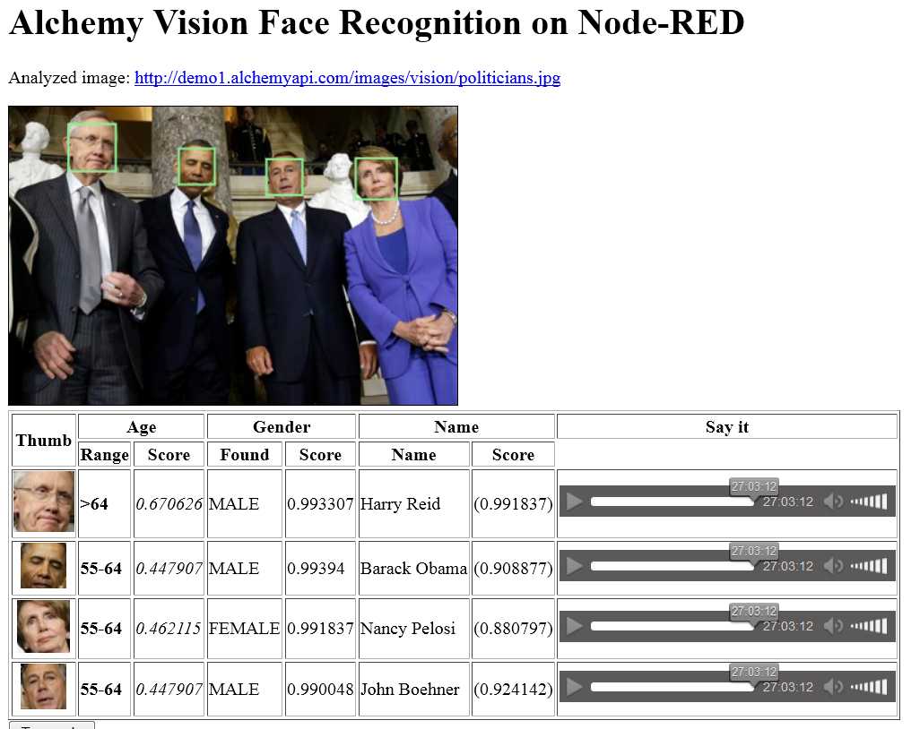

# Node-RED Alchemy Vision image-to-speech advanced Lab
## Overview
In this lab we will explore how Node-RED rapid prototyping capabilities allow to easily combine several Watson services into a single application using Node-RED rapid prototyping capabilities.  

This lab will focus on bringing audio to the previously developed Alchemy Vision Enhanced lab ([alchemy_image_analysis_enh](..\alchemy_image_analysis_enh\alchemy_image_analysis_enh.md)), by reusing the service developed in the Text-to-Speech lab [lab_text_to_speech](..\..\watson_services_labs\text_to_speech\lab_text_to_speech.md)

The Alchemy Vsion API returns a wealth of information when celebrities' faces are detected on an image, including their names and related web URLs. We will use this input, presented in the `identity` attribute to speak up the names.

## Prerequisite
The text-to-speech audio service should be deployed at the `/tts/sayit` URL, using the flow from the TTS lab at [TTS-Lab-WithParamCheck.json](..\..\watson_services_labs\text_to_speech\TTS-Lab-WithParamCheck.json)

We will then modify the Alchemy Vision Enhanced lab flow to add simple audio to it, so the base of this lab will be the flow from [AlchVis-Lab-WebFacesThumbs.json](..\alchemy_image_analysis_enh\AlchVis-Lab-WebFacesThumbs.json)

## Flow building
 - Import into a new flow from the [AlchVis-Lab-WebFacesThumbs.json](..\alchemy_image_analysis_enh\AlchVis-Lab-WebFacesThumbs.json) flow.
 - To avoid URL conflicts, rename the HTTP Input node URL's to `/alchvoice`, deploy and test that this works.
 - To add the audio playback capability, we will simply use the HTML `<audio>` tag, similarly to what has been done in the web TTS lab.
 - Edit the `Report Faces` template node. We will add a column to that table, which will conditionally add an audio tag to speak out the names of the personalities when identified by the Alchemy Vision API.  We'll add a `Say it!` column to the table:
 ```HTML
 <th rowspan='2'>Say it</th>
```
and populate it with an audio tag that refers to the previously built TTS flow when the identity attribute is set:  
```HTML
<td><audio src="/talk/sayit?text_to_say={{identity.name}}" controls></audio></td>
```

Start the lab flow by pointing at `./alchvoice`URL, the output table will show additional audio controls for recognized personalities:  


The completed flow is available at [alch_image_to_speech.json](alch_image_to_speech.json)