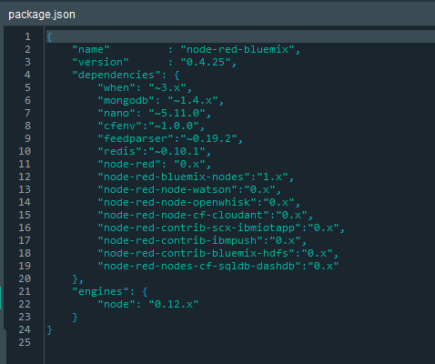

# Installing Watson Developer Cloud Contribution Nodes 

## Overview
Additional Watson services nodes are available from the Watson Developer Cloud. If you wish to use these nodes
you will need to modify Node-RED dependencies. These instructions show how to install these contribution nodes into 
your Node-RED instance on Bluemix. 

## Modify Node-RED Dependencies.
On the Bluemix console, select your Node-RED application. At the top right you will see an "ADD GIT" button.


Click on this button. This will create a GIT repository for your Node-RED instance. Once the repository has been created, the
"ADD GIT" button will be replaced with an "Edit Code" button. 


Click on the Edit button. The file that you will be changing is "package.json". 


Select the file. 



Add a comma separator and a line pointing at the git home for the contribution nodes from Watson Developer Cloud


The change is 

```
	"node-red-contrib-watson-developer-cloud-nodes" : "git://github.com/watson-developer-cloud/node-red-nodes.git"
```


Save your changes


Deploy your changes


Wait for Node-RED to restart


The contribution nodes will then be available for you to use on the palette.


